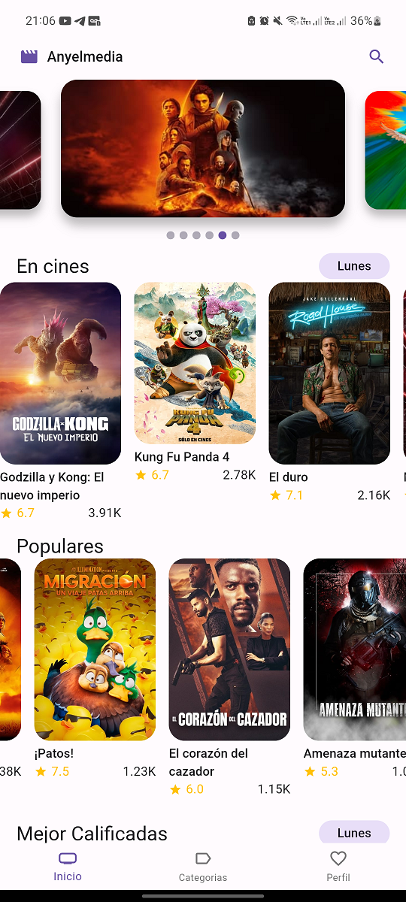
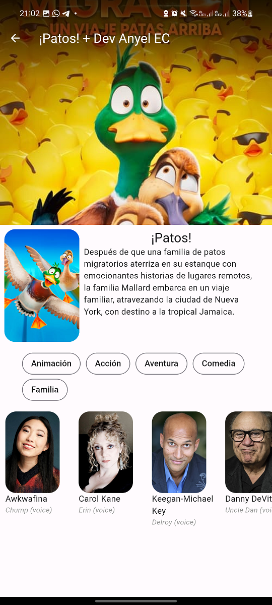

# app_cinema_full

In dev.... configurete file of env, your api key of moviedb
```
- flutter pub run build_runner build
```

# IN DEV........
### Home
 
### Show Films Part 1 
 
### Show Films Part 2
 
### Search 
 


# IN DEV........